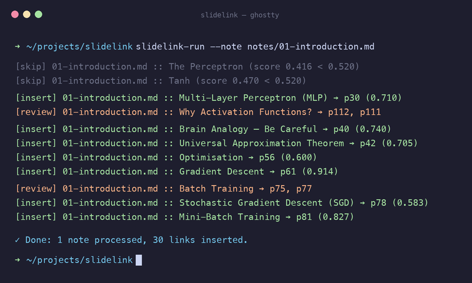

<div align="center">

# SlideLink

**Match your markdown lecture notes to the right slides — no LLM, no internet.**

[](https://www.python.org/)
[](LICENSE)
[](https://github.com/yuazi/SlideLink/actions)



</div>

---

`SlideLink` is a CLI tool that scans your markdown notes and embeds the most relevant slide images from a PDF directly into them. It uses **TF-IDF** and **visual analysis** to figure out which slide fits each section — runs fully offline.

## How it looks

When you run `slidelink-run`, the tool analyzes your sections and gives you real-time feedback:

- **`[insert]`**: High-confidence match found. The slide is rendered as a PNG and linked in your markdown.
- **`[review]`**: Ambiguous match (multiple slides with similar scores). Both are linked with a comment for you to choose the best one.
- **`[skip]`**: No strong match found; no changes made to that section.

### In your Markdown:
Before:
```markdown
### Multi-Layer Perceptron (MLP)
The network output is f(X; W, b).
```

After:
```markdown
### Multi-Layer Perceptron (MLP)

The network output is f(X; W, b).
```

## Key Features

- **TF-IDF Semantic Matching**: Uses term frequency-inverse document frequency to find the most relevant slide for each note section.
- **Visual Analysis**: Detects diagrams, images, and drawing density to prioritize slides with high visual information.
- **Build-Slide Detection**: Automatically identifies "build" sequences (where content is added across multiple slides) and selects the most complete version of the slide.
- **LaTeX Support**: Optional alias mapping for math-heavy notes to improve matching accuracy.
- **Fully Offline**: No data leaves your machine. No LLM or API keys required.

## Why use this?

| Field | Example |
|---|---|
| **Medicine** | Link clinical notes to anatomical diagrams and X-rays |
| **Psychology** | Connect case study notes to experimental data visualizations |
| **STEM** | Pair LaTeX-heavy derivations with the matching algorithmic slide |
| **Anything else** | Drop in your `.md` notes and `.pdf` slides and run it |

## Getting Started

The repo already has the expected folder structure set up, so you can jump straight to installation.

### 1. Installation

Clone and install in editable mode:

```bash
git clone https://github.com/yuazi/SlideLink.git
cd SlideLink
pip install -e .
```

### 2. Add your files

- **Notes:** drop your `.md` files into `notes/`
- **Slides:** drop your `.pdf` files into `notes/pdfs/`

> **Tip:** Matching works best when note and slide filenames are the same (e.g. `01_Intro.md` and `01_Intro.pdf`).

### 3. Run

```bash
slidelink-run
```

SlideLink will find the best matching slides, export them as images into `notes/screenshots/`, and insert the image links into your notes.

### 4. Undo

To strip all inserted screenshots and comments:

```bash
slidelink-revert --revert
```

## CLI Reference

| Argument | Default | Description |
|---|---|---|
| `--note` | None | Process a single markdown file instead of the whole directory. |
| `--notes-dir` | `notes` | Directory with markdown notes. |
| `--pdf-dir` | `notes/pdfs` | Directory with PDF slides. |
| `--asset-dir` | `notes/screenshots` | Where extracted slide images go. |
| `--min-score` | `0.33` | Minimum similarity score to accept a match. |
| `--subject-label` | `Lecture` | Prefix for image filenames and log output. |
| `--aliases-file` | None | JSON file mapping LaTeX commands to plain-text aliases. |
| `--headings-config` | None | JSON file with `skip` and `generic` heading lists. |
| `--dry-run` | `False` | Preview changes without touching any files. |
| `--revert` | `False` | Remove all inserted screenshots and review comments. |

## Customization

### LaTeX Aliases

For math-heavy notes, you can map LaTeX commands to readable aliases so the TF-IDF matching works better:

```json
{
  "\\nabla": ["nabla", "gradient", "grad"],
  "\\sigma": ["sigma", "sigmoid", "standard deviation"]
}
```

```bash
slidelink-run --aliases-file examples/aliases_stem.json
```

### Heading Config

Control which headings get skipped or need a higher confidence score before a slide is inserted:

```json
{
  "skip": ["introduction", "further reading"],
  "generic": ["overview", "results"]
}
```

```bash
slidelink-run --headings-config examples/headings_config.json
```

## Project Structure

```
SlideLink/
├── notes/              # Your markdown notes go here
│   ├── pdfs/           # Your PDF slides go here
│   └── screenshots/    # Auto-generated slide images (created by the tool)
├── slidelink/          # Core Python package
├── examples/           # Example alias and heading config files
├── scripts/            # Helper scripts
└── tests/              # Test suite
```

## Contributing

Bug reports and suggestions are welcome — just [open an issue](https://github.com/yuazi/SlideLink/issues).

## License

[MIT](LICENSE)
